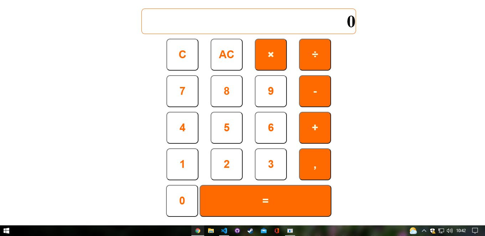
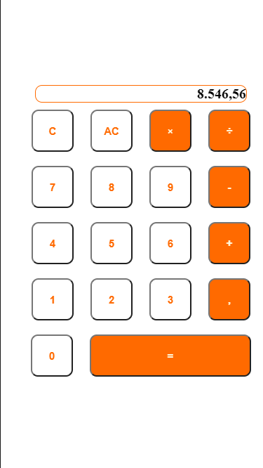

# *__Calculadora2.0__*

    
    

 

>Uma calculadora simples para resolução de problemas matematicos

## **_Tecnologias_**

    
    
    

#

No desktop ou em seu aparelho movél, seja seu celular, um tablet, ou um aparelho com maiores dimensões, você pode usar com facilidade e praticidade.

    

#
Deixando um link no desktop ou na tela inicial do celular facilita e agiliza sua vida na hora que precisar calcular algo na hora da presa

    

#
## **_Licença_**
>MIT License &#169; zandrocr
